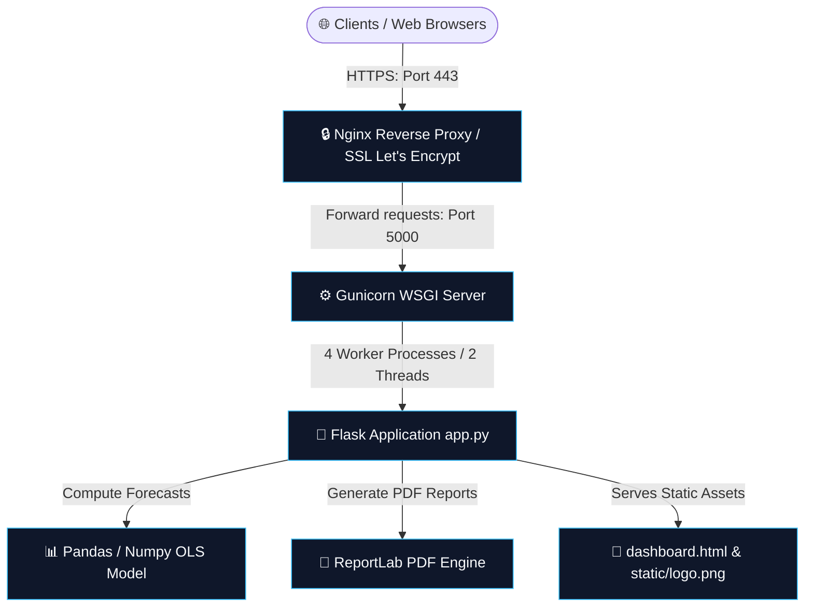

# Apple Enterprise Financial Modeling & Dashboard
## Production Deployment Guide

This comprehensive, step-by-step production deployment guide covers the lifecycle, system architecture, environment setup, production servers (Linux/Windows), reverse-proxy configurations, SSL, containerization, performance optimizations, and security checklists for the Flask-based financial modeling platform.

---

## 🗺️ Production Architecture

The diagram below outlines the standard production routing topology. A client browser makes a secure request over HTTPS, Nginx handles SSL termination and reverse-proxies requests to Gunicorn, which manages thread concurrency to the Flask application. The Python app leverages Pandas/Numpy for forecast modeling and ReportLab to stream on-the-fly PDFs.



---

## 📋 1. Core Technical Overview

Your platform is built with a lightweight but computationally heavy python backend:

| Layer | Technology | Operational Function |
| :--- | :--- | :--- |
| **App Framework** | Flask 3.x (Python 3.11+) | Handles routing, API controllers, PDF file stream downloads, and interactive chat inputs. |
| **Data Engine** | Pandas & Numpy | Standardizes transactional data arrays, processes P&L forecasts, and executes multi-dimensional filtering. |
| **Predictive Engine**| Linear Regression (OLS Polyfit)| Forecasts 3-month regional, product, and gross margin trajectories dynamically. |
| **Reporting Engine** | ReportLab | Compiles base64 Chart.js canvas streams into dynamic multi-page A4 PDF documents. |
| **Client Interface** | Vanilla HTML5 / JS / Tailwind | Provides an immersive dashboard containing real-time visual scenario sliders. |

---

## 🔒 2. Production Environment Settings

Never run a production Flask application in the default debug mode (`app.run(debug=True)`). Production configurations must be driven by Environment Variables.

Create a `.env` file in your root folder (this should **never** be committed to Git):

```bash
# Flask Mode
FLASK_ENV=production
FLASK_DEBUG=0

# Security (Replace with a cryptographically secure 32-character string)
SECRET_KEY=e8fcae21e05d045ad7521cf9a9cb84de0a2a4b8df90c8414cb2a784d12c8a14b

# Server Binding
PORT=5000
HOST=0.0.0.0
```

> [!IMPORTANT]
> To load `.env` variables automatically in Python, install `python-dotenv` and add `from dotenv import load_dotenv; load_dotenv()` to the top of [app.py](file:///c:/Users/V~/Downloads/Streamlit/app.py).

---

## 🐳 3. Option A: Containerized Deployment (Docker & Docker Compose)
*Recommended for cloud platforms (AWS, Render, Railway, DigitalOcean).*

We have already created the [Dockerfile](file:///c:/Users/V~/Downloads/Streamlit/Dockerfile) and [docker-compose.yml](file:///c:/Users/V~/Downloads/Streamlit/docker-compose.yml) in your workspace root. 

### Local Building & Verification
To test your production container environment locally:

```powershell
# Build and start the container
docker compose up --build -d

# Verify container is running and check ports
docker ps

# Stream logs in real-time
docker compose logs -f
```

Open [http://localhost:5000](http://localhost:5000) to verify.

### Deploying to Container Platforms (Render / Railway)
1. Push your code, including `Dockerfile`, `docker-compose.yml`, and `requirements.txt`, to a private GitHub/GitLab repository.
2. Log into your dashboard (e.g., [Render](https://render.com)).
3. Select **New Web Service** and connect your repository.
4. Set the **Runtime** to `Docker` (Render will auto-detect the `Dockerfile`).
5. Under Environment variables, add:
   * `FLASK_ENV`: `production`
6. Click **Deploy**. The platform will build the multi-stage image, expose port `5000`, and handle SSL certificates automatically.

---

## 🐧 4. Option B: Linux Virtual Server (Ubuntu / Debian VPS)
*Ideal for AWS EC2, DigitalOcean Droplets, Linode, or Google Compute Engine.*

This architecture uses **Gunicorn** (Green Unicorn) as the WSGI application server, **Systemd** for process management, and **Nginx** as a reverse proxy.

### Step 1: Install System Dependencies
Update package definitions and install Python, pip, virtualenv, and Nginx:
```bash
sudo apt update
sudo apt install -y python3-pip python3-venv nginx git curl
```

### Step 2: Clone & Set Up Virtual Environment
```bash
# Clone repository and move to project directory
cd /var/www
sudo git clone https://github.com/yourusername/apple-financial-dashboard.git Streamlit
cd Streamlit

# Create virtual environment and activate
python3 -m venv venv
source venv/bin/activate

# Install dependencies
pip install --upgrade pip
pip install -r requirements.txt
```

### Step 3: Configure Systemd Service
Systemd will ensure that Gunicorn runs in the background and restarts automatically if the server reboots or crashes.

Create a new service configuration:
```bash
sudo nano /etc/systemd/system/apple_dashboard.service
```

Paste the following configurations (replacing user paths where appropriate):
```ini
[Unit]
Description=Apple Enterprise Financial Modeling Dashboard
After=network.target

[Service]
User=www-data
WorkingDirectory=/var/www/Streamlit
Environment="PATH=/var/www/Streamlit/venv/bin"
Environment="FLASK_ENV=production"
ExecStart=/var/www/Streamlit/venv/bin/gunicorn --workers 4 --threads 2 --bind 127.0.0.1:5000 app:app

[Install]
WantedBy=multi-user.target
```

Start the service and enable it to run on system boot:
```bash
sudo systemctl daemon-reload
sudo systemctl start apple_dashboard
sudo systemctl enable apple_dashboard

# Check operational status
sudo systemctl status apple_dashboard
```

---

## 🪟 5. Option C: Windows Server Deployment (IIS & Waitress)
*Ideal for internal corporate networks running Windows Server Active Directory.*

Because **Gunicorn** is not natively compatible with Windows, we use **Waitress** (a high-performance production WSGI server designed for both Unix and Windows) combined with IIS (Internet Information Services) or Nginx for Windows.

### Step 1: Set Up Project & Python Environment
1. Install Python 3.11+ on the Windows Server. Make sure to check the box to **"Add Python to PATH"** during installation.
2. Open PowerShell as Administrator, clone the codebase to your chosen directory (e.g. `C:\inetpub\apple_dashboard`), and set up a virtual environment:
   ```powershell
   cd C:\inetpub\apple_dashboard
   python -m venv venv
   .\venv\Scripts\Activate.ps1
   pip install -r requirements.txt
   ```

### Step 2: Create a Start Script
Create a startup batch file named `run_production.bat` in `C:\inetpub\apple_dashboard\`:
```batch
@echo off
cd /d C:\inetpub\apple_dashboard
set FLASK_ENV=production
call venv\Scripts\activate.ps1
python -c "import waitress; waitress.serve(app, host='127.0.0.1', port=5000)"
```
Waitress will serve the application on `http://127.0.0.1:5000` via multi-threaded worker queues, natively managing Windows system sockets.

### Step 3: Setup as a Windows Service (NSSM)
To keep the application running continuously in the background on Windows, use the **Non-Sucking Service Manager (NSSM)**:
1. Download NSSM from [nssm.cc](https://nssm.cc/) and extract it.
2. In Administrator PowerShell, run:
   ```powershell
   \path\to\nssm.exe install AppleDashboard
   ```
3. A GUI window will pop up:
   * **Path**: `C:\inetpub\apple_dashboard\run_production.bat`
   * **Startup directory**: `C:\inetpub\apple_dashboard`
4. Click **Install Service**.
5. Start the service:
   ```powershell
   Start-Service AppleDashboard
   ```

### Step 4: Configure IIS Application Request Routing (ARR)
To expose the application on standard port 80/443:
1. Install **IIS (Internet Information Services)** via Server Manager roles.
2. Download and install **IIS URL Rewrite Module** and **Application Request Routing (ARR)**.
3. Open IIS Manager, click on the server node, double-click **Application Request Routing Cache**, click **Server Settings**, and check **Enable SSL Offloading** and **Enable proxy**.
4. Right-click **Sites** -> **Add Website**. Name it, set the binding, and point the Physical Path to an empty folder (e.g., `C:\inetpub\wwwroot\apple_proxy`).
5. Double-click **URL Rewrite** on your new site, add a new **Blank Rule**:
   * **Pattern**: `(.*)`
   * **Action Type**: `Rewrite`
   * **Rewrite URL**: `http://127.0.0.1:5000/{R:1}`
6. Save and restart IIS. Requests to port 80 will now be reverse-proxied transparently to Waitress on port 5000.

---

## 🔒 6. Reverse Proxy & SSL Setup (Nginx)

To enable SSL (HTTPS) and serve assets efficiently, configure **Nginx** as a reverse proxy.

### Step 1: Configure Nginx Virtual Host
Create an Nginx configuration file:
```bash
sudo nano /etc/nginx/sites-available/apple_dashboard
```

Paste the following configuration (replace `yourdomain.com` with your actual domain name):
```nginx
server {
    listen 80;
    server_name yourdomain.com www.yourdomain.com;

    location / {
        proxy_pass http://127.0.0.1:5000;
        proxy_set_header Host $host;
        proxy_set_header X-Real-IP $remote_addr;
        proxy_set_header X-Forwarded-For $proxy_add_x_forwarded_for;
        proxy_set_header X-Forwarded-Proto $scheme;
        
        # Adjust timeouts for ReportLab PDF compilation
        proxy_read_timeout 150s;
        proxy_connect_timeout 150s;
        proxy_send_timeout 150s;
    }

    # Serve static assets directly through Nginx to bypass Python and optimize performance
    location /static/ {
        alias /var/www/Streamlit/static/;
        expires 30d;
        add_header Cache-Control "public, no-transform";
    }
}
```

Enable the site configuration and restart Nginx:
```bash
sudo ln -s /etc/nginx/sites-available/apple_dashboard /etc/nginx/sites-enabled/
sudo nginx -t
sudo systemctl restart nginx
```

### Step 2: Install SSL Certificates (Certbot / Let's Encrypt)
Secure your application with Let's Encrypt SSL certificates:
```bash
sudo apt install -y certbot python3-certbot-nginx
sudo certbot --nginx -d yourdomain.com -d www.yourdomain.com
```
Follow the interactive prompts to enable automatic redirection of all traffic from HTTP to HTTPS. Certbot will configure this in Nginx and establish a auto-renew cronjob.

---

## ⚡ 7. Performance & Memory Optimizations

Because this platform processes matrix calculations (Pandas and Numpy) and generates heavy graphics inside ReportLab PDFs, follow these performance optimizations:

1. **Gunicorn Thread Count**: Set Gunicorn to run with `workers = (2 * CPU cores) + 1` and `threads = 2` to handle concurrency during intensive mathematical matrix transformations.
2. **Numpy/Pandas Parallelization**: If deploying on multi-core servers, set these variables in your Systemd unit environment to limit Numpy thread overhead competing for system resources:
   ```ini
   Environment="OMP_NUM_THREADS=1"
   Environment="MKL_NUM_THREADS=1"
   ```
3. **Nginx Client Buffering**: Increase buffers in `nginx.conf` to accommodate large base64 canvas strings transmitted from Chart.js during PDF downloads:
   ```nginx
   client_max_body_size 15M;
   client_body_buffer_size 128k;
   ```
4. **Memory Allocation**: If running on ultra-low-cost micro instances (e.g. 512MB RAM), enable a Linux **Swap File** (1GB or 2GB) to protect the OLS prediction matrix from triggering OS Out-Of-Memory (OOM) kills.

---

## 🛡️ 8. Security Hardening Checklist

Before marking the dashboard as fully active, verify these settings:

- [ ] **Flask Debug Off**: Confirm that `app.config['DEBUG']` is false or `FLASK_DEBUG=0` is set in production.
- [ ] **Rotate Secret Key**: Never use defaults. Ensure `app.secret_key` is randomized and fed from system variables.
- [ ] **Enable Secure Headers**: Adjust your reverse proxy or configure Flask-Talisman to enforce security headers:
  * `Strict-Transport-Security` (HSTS)
  * `X-Frame-Options: SAMEORIGIN` (Protects against clickjacking)
  * `X-Content-Type-Options: nosniff`
- [ ] **Secure PDF Download Payload**: Validate that incoming base64 images inside `/api/download_pdf` strictly match standard PNG header markers (`data:image/png;base64,`) to prevent arbitrary file writes.
- [ ] **Input Constraints**: Limit the custom float ranges in `/api/data` for parameters such as `scen["mat"]` or `scen["labor"]` (e.g., between `0.1` and `5.0`) to avoid server computational lockups or infinite inventory calculation loops.

---

## 🛠️ 9. Troubleshooting Production Pitfalls

### Issue A: ReportLab throws an Exception during PDF Compile
* **Cause**: On Linux servers, the default system user `www-data` or the Docker `appuser` may not have write privileges to verify local path contexts, or the custom logo file `static/logo.png` is not accessible.
* **Resolution**: Ensure the `static/logo.png` exists in the deployment directory and is readable by the runtime user:
  ```bash
  sudo chown -R www-data:www-data /var/www/Streamlit/static
  sudo chmod -R 755 /var/www/Streamlit/static
  ```

### Issue B: Chart.js Base64 Images fail to appear in the PDF
* **Cause**: The browser doesn't send the rendered chart image data back to the server. The Flask backend depends on the frontend sending the chart canvas elements converted to base64 images inside the `/api/download_pdf` POST request payload.
* **Resolution**: Verify that the browser frontend is calling `chartInstance.toBase64Image()` correctly and including the strings inside the JSON payload before triggering the redirect.

### Issue C: Out of Memory (OOM) Crashes during Forecast Calculations
* **Cause**: Large scenarios combined with high concurrency on tiny VPS nodes trigger the OS Out-of-Memory killer.
* **Resolution**: Establish a virtual swap space on your Linux machine:
  ```bash
  sudo fallocate -l 1G /swapfile
  sudo chmod 600 /swapfile
  sudo mkswap /swapfile
  sudo swapon /swapfile
  echo '/swapfile none swap sw 0 0' | sudo tee -a /etc/fstab
  ```
